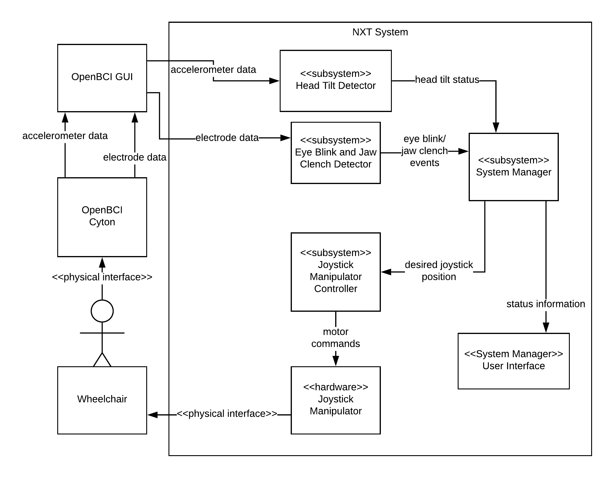

# System Overview

The goal is to create an accelerometer-based control system for a wheelchair.

## Unique Context

We have a little time to develop this Maker Faire exhibit. Sub-systems are likely to change significantly as they move from the prototype stage to a final, performance-tuned implementation. Due to the short timeline, it is possible some sub-systems will not be developed further than a functional prototype.

## High-Level Design

### Diagram

Any sub-system within the "NXT System" box is a software or hardware component created for the Maker Faire exhibit.

### Design

The system as presented in the diagram separates major system functionality into separate subsystems that communicate through language-agnostic networking sockets. This allows for high modularity so that an entirely new implementation of a sub-system can be put into service without requiring a change in any other part of the system.

### Sub-system Responsibilities

#### Head Tilt Detector

Makes determinations on head tilt directions and magnitudes based on accelerometer data from the OpenBCI Cyton board.

#### Eye Blink and Jaw Clench Detector

Identifies eye blink and jaw clench events based on a stream of data from electrodes placed on the user's head. These detection capabilities (specifically eye blinks) will be crucial to an EEG-based control scheme in our future research.

#### Joystick Manipulator Controller

Sends appropriate motor commands to the joystick manipulator to move the joystick to the desired location.

#### System Manager

The System Manager is responsible for taking action based on input from the Head Tilt Detector and Eye Blink and Jaw Clench Detector sub-systems. When appropriate, the System Manager will send the desired joystick location to the Joystick Manipulator Controller so that the wheelchair moves.

The System Manager will also contain a user interface to provide information on the status of the system. This interface will also enable manual directional control of the wheelchair and options to *engage* or *disengage* the head-tilt control mechanism.
